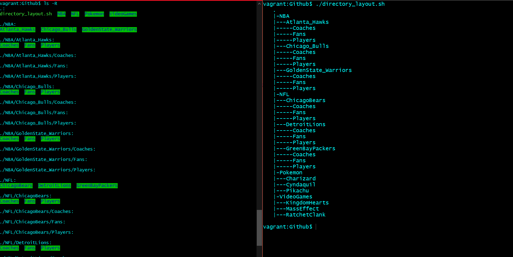

This script prints directories in a nicer format.
===

To give a breakdown of the project

1. Checks for argument which should be a path
2. Prints if empty directory
3. Changes format to view

## Why is this needed?

* Alternative to ls -R
* Wayyyy easier to view on the eyes

## Who can use this?

* System Admins who have tons of directories to parse through
* Anyone!

**How it is displayed**

